# Data Visualization with Matplotlib and Seaborn

## Table of Contents
1. [Why Visualization?](#why-visualization)
2. [Importing the Modules](#importing-the-modules)
3. [Line Charts](#line-charts)
4. [Improving and Customizing Line Charts](#improving-and-customizing-line-charts)
5. [Scatter Plots](#scatter-plots)
6. [Histograms](#histograms)
7. [Bar Charts](#bar-charts)

---

## Why Visualization?

Most real-world data comes in the form of numbers — thousands or even millions of rows of values that are impossible to interpret just by looking at them. Visualization solves this by converting raw numbers into a visual format that our brains can process instantly.

For example, instead of scanning 365 rows of daily case counts to spot a trend, a single line chart shows you the rise and fall at a glance. Instead of comparing 12 monthly totals in a table, a bar chart makes the highest and lowest months immediately obvious.

Common chart types and what they are best used for:

| Chart Type | Best Used For | Example |
|------------|--------------|---------|
| **Line Chart** | Trends over time | Daily cases over a year |
| **Bar Chart** | Comparing values across categories | Total cases per month |
| **Histogram** | Distribution of a single value | How often case counts fall in a range |
| **Scatter Plot** | Relationship between two variables | Cases vs tests per day |
| **Pie Chart** | Proportions of a whole | Share of cases per region |
| **Heatmap** | Patterns across two dimensions | Cases by weekday and month |

Good visualizations do not just make data look nice — they reveal patterns, outliers, and trends that would otherwise stay hidden in a spreadsheet.

---

## Importing the Modules

Python has two main libraries for data visualization that are used together:

- **Matplotlib** — the foundation. Handles all basic plotting: line charts, bar charts, histograms, scatter plots, and full control over labels, colors, axes, and figure size.
- **Seaborn** — built on top of Matplotlib. Adds more advanced and visually polished chart types with less code, and works especially well with pandas DataFrames.

```python
import matplotlib.pyplot as plt
import seaborn as sns
```

**Why `plt` and `sns`?** These are the standard aliases used universally — every tutorial, documentation page, and Stack Overflow answer uses them. Stick to these aliases to keep your code readable and consistent.

---

## Line Charts

### What is a Line Chart?

A line chart is the most basic form of data visualization. It plots individual data points along an axis and connects them with a line, making it easy to see how a value changes over a sequence — most commonly over time.

### Basic Line Chart

To draw a line chart, pass a list of values to `plt.plot()` and call `plt.show()` to display it:

```python
yield_apples = [0.895, 0.91, 0.919, 0.926, 0.929, 0.931]

plt.plot(yield_apples)
plt.show()
```

`plt.plot()` draws the chart and `plt.show()` actually renders and displays it. Without `plt.show()`, nothing appears on screen.

**Output:**


The x-axis shows the index of each value (0, 1, 2...) and the y-axis shows the actual values. By default there are no labels or titles — those need to be added manually, which is covered in the next section.

---

## Improving and Customizing Line Charts

### Adding Custom Axis Values

The basic plot uses row indexes on the x-axis which are not meaningful. You can pass a second list to `plt.plot()` to use as the x-axis values — the first argument is always x and the second is y:

```python
yield_apples = [0.895, 0.91, 0.919, 0.926, 0.929, 0.931]
years = [2010, 2011, 2012, 2013, 2014, 2016]

plt.plot(years, yield_apples)
plt.show()
```

**Output:**

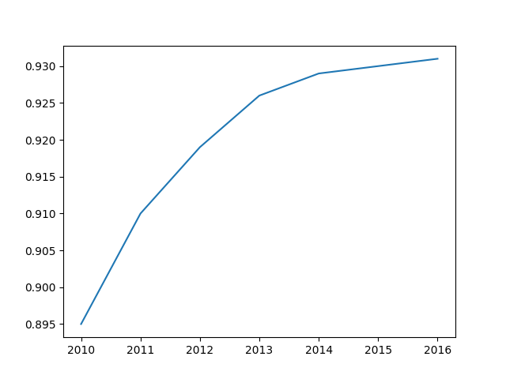

### Adding Axis Labels

The axes still have no labels, so it is not clear what the chart is showing. Use `plt.xlabel()` and `plt.ylabel()` to label them:

```python
plt.plot(years, yield_apples)
plt.xlabel('Year')
plt.ylabel('Yield')
plt.show()
```

**Output:**

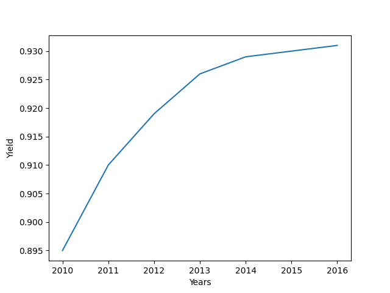

**Note:** Any function you call after `plt.plot()` applies to the same plot until `plt.show()` is called.

### Plotting Multiple Lines

You can plot more than one line on the same chart by calling `plt.plot()` multiple times before `plt.show()`. Each call adds a new line and Matplotlib automatically assigns a different color to each:

```python
years = range(2000, 2012)
yield_apples = [0.895, 0.91, 0.919, 0.926, 0.929, 0.931]
yield_oranges = [0.925, 0.921, 0.900, 0.895, 0.890, 0.885]

plt.plot(years, yield_apples)
plt.plot(years, yield_oranges)
plt.xlabel('Year')
plt.ylabel('Yield')
plt.show()
```

**Output:**

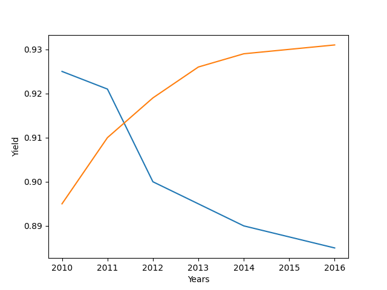

### Adding a Title and Legend

With multiple lines on the same chart, you need a legend to tell which line is which. Use `plt.title()` for the chart title and `plt.legend()` with a list of labels in the same order as your `plt.plot()` calls:

```python
plt.plot(years, yield_apples)
plt.plot(years, yield_oranges)
plt.xlabel('Year')
plt.ylabel('Yield')
plt.title("Crop Yields in Pakistan")
plt.legend(["Apples", "Oranges"])
plt.show()
```

**Output:**

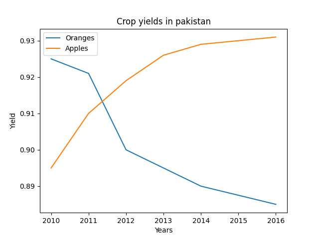

### Adding Markers

Markers are symbols drawn at each data point on the line, making it easier to see exact values without guessing. Pass the `marker` argument to `plt.plot()`:

```python
plt.plot(years, yield_apples, marker='o')
plt.plot(years, yield_oranges, marker='X')
plt.xlabel('Year')
plt.ylabel('Yield')
plt.title("Crop Yields in Pakistan")
plt.legend(["Apples", "Oranges"])
plt.show()
```

**Output:**

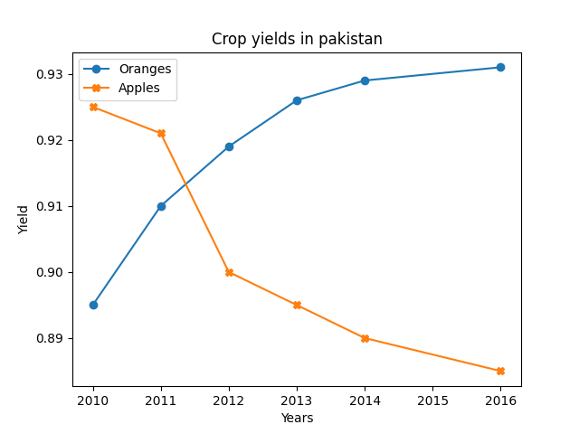

You can use any marker symbol from the full list here: [Matplotlib Markers Reference](https://matplotlib.org/stable/api/markers_api.html)

### Line Style Shorthand (fmt)

Instead of passing multiple separate arguments, you can use a shorthand format string `fmt` to set the marker, line style, and color all in one string:

```
fmt = [marker][line][color]
```

```python
# 's' = square marker, '-' = solid line, 'b' = blue
plt.plot(years, yield_apples, 's-b')

# markers only, no line (skip the line character)
plt.plot(years, yield_oranges, 'sb')
```

**Output:**

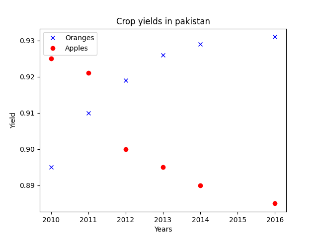

### Customizing Line and Marker Appearance

For full control beyond the shorthand, you can pass individual styling arguments to `plt.plot()`:

| Argument | Purpose | Example Value |
|----------|---------|--------------|
| `color` | Line and marker color | `'red'`, `'#ff0000'` |
| `linestyle` | Style of the line | `'-'`, `'--'`, `':'`, `'-.'` |
| `linewidth` | Thickness of the line | `2`, `0.5` |
| `marker` | Marker shape at each point | `'o'`, `'s'`, `'X'`, `'^'` |
| `markersize` | Size of the marker | `8`, `12` |
| `markeredgecolor` | Color of the marker border | `'black'`, `'blue'` |
| `markeredgewidth` | Thickness of the marker border | `1`, `2` |
| `markerfacecolor` | Fill color of the marker | `'white'`, `'green'` |
| `alpha` | Transparency of the line (0=invisible, 1=solid) | `0.5`, `0.8` |

```python
plt.plot(years, yield_apples,
         color='green',
         linestyle='--',
         linewidth=2,
         marker='o',
         markersize=8,
         markeredgecolor='black',
         markeredgewidth=1,
         markerfacecolor='white',
         alpha=0.8)
plt.show()
```

### Changing the Figure Size

If the default chart feels too small or cramped, use `plt.figure()` with the `figsize` parameter before your plot call. The values are `(width, height)` in inches:

```python
plt.figure(figsize=(12, 6))
plt.plot(years, yield_apples, marker='o')
plt.plot(years, yield_oranges, marker='X')
plt.xlabel('Year')
plt.ylabel('Yield')
plt.title("Crop Yields in Pakistan")
plt.legend(["Apples", "Oranges"])
plt.show()
```

**Note:** `plt.figure()` must always be called **before** `plt.plot()`, otherwise it opens a new empty figure instead of resizing the current one.

### Enhancing Plots with Seaborn Styles

Seaborn provides ready-made styles that instantly make Matplotlib plots look cleaner and more polished — without changing any of your plotting code. Just call `sns.set_style()` once before your plot:

```python
sns.set_style("whitegrid")

plt.plot(years, yield_apples, marker='o')
plt.plot(years, yield_oranges, marker='X')
plt.xlabel('Year')
plt.ylabel('Yield')
plt.title("Crop Yields in Pakistan")
plt.legend(["Apples", "Oranges"])
plt.show()
```

**Output:**

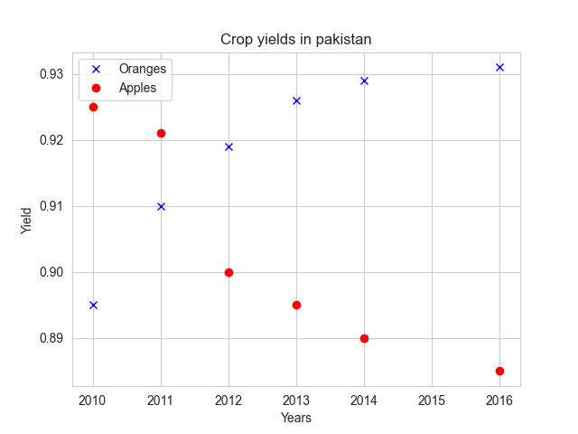

Available styles: `"darkgrid"`, `"whitegrid"`, `"dark"`, `"white"`, and `"ticks"`. See the full reference and visual previews here:
- [Seaborn Style Documentation](https://seaborn.pydata.org/tutorial/aesthetics.html)
- [Visual Style Gallery](https://python-graph-gallery.com/104-seaborn-themes/)

### Changing Matplotlib Default Parameters

For finer control over global defaults — like font size, line width, or figure size — use `matplotlib.rcParams`. These are settings that apply to **every** plot in your script unless overridden individually:

```python
import matplotlib

# Set default font size to 14 for all plots
matplotlib.rcParams["font.size"] = 14

# Other useful defaults
matplotlib.rcParams["figure.figsize"] = (10, 6)   # Default figure size
matplotlib.rcParams["lines.linewidth"] = 2         # Default line width
matplotlib.rcParams["axes.grid"] = True            # Show grid by default
```

To see every parameter available, just print the full dictionary:

```python
print(matplotlib.rcParams)
```

**Note:** `rcParams` changes persist for the entire session. If you only want to change the style for one plot, use the individual arguments in `plt.plot()` instead.

## Scatter Plots

### Line Plot vs Scatter Plot

A line plot works well when your data has a natural order or sequence — like values changing over time. A scatter plot is used instead when you want to explore the **relationship between two independent variables**, where order does not matter. Each point on a scatter plot represents one row of data, plotted by its x and y values.

### Loading the Example Dataset

Seaborn comes with several built-in datasets for practice. The **iris dataset** is a classic — it contains measurements of flower dimensions across three species:

```python
flower_df = sns.load_dataset("iris")
```

This loads a pandas DataFrame directly, the same as if you had used `pd.read_csv()`. You can use either approach with your own data.

### Why Not a Line Plot for This Data?

You might try plotting the relationship between sepal length and sepal width using a line plot first:

```python
plt.plot(flower_df.sepal_length, flower_df.sepal_width)
plt.xlabel('Sepal Length')
plt.ylabel('Sepal Width')
plt.title('Sepal Dimensions')
plt.show()
```

**Output:**

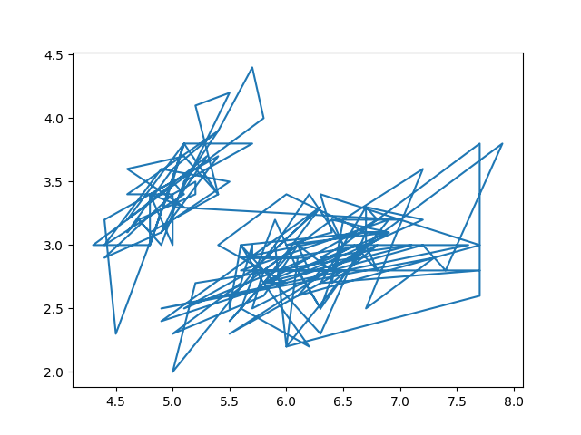

The result is a chaotic, tangled mess of lines. This is because the data has no meaningful order — the line just connects random points one after another. This is exactly when a scatter plot is the right choice instead.

### Basic Scatter Plot

Seaborn's `sns.scatterplot()` plots each row as an individual point. Seaborn automatically uses the column names as axis labels:

```python
sns.scatterplot(x=flower_df.sepal_length, y=flower_df.sepal_width)
plt.show()
```

**Note:** Just like with Matplotlib, `plt.show()` is required to render the plot.

**Output:**

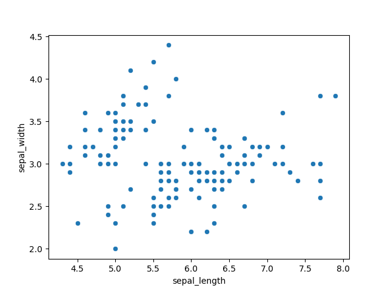

The scatter plot immediately makes it clear there is no strong linear relationship between sepal length and width — but you can start to see clusters forming, suggesting there may be distinct groups in the data.

### Adding Hue to Show Groups

When your data contains distinct groups or categories, you can color each point by its group using the `hue` parameter. This makes clusters and group-level patterns immediately visible. Use `s` to control the size of the points:

```python
sns.scatterplot(x=flower_df.sepal_length,
                y=flower_df.sepal_width,
                hue=flower_df.species,
                s=100)
plt.show()
```

**Output:**

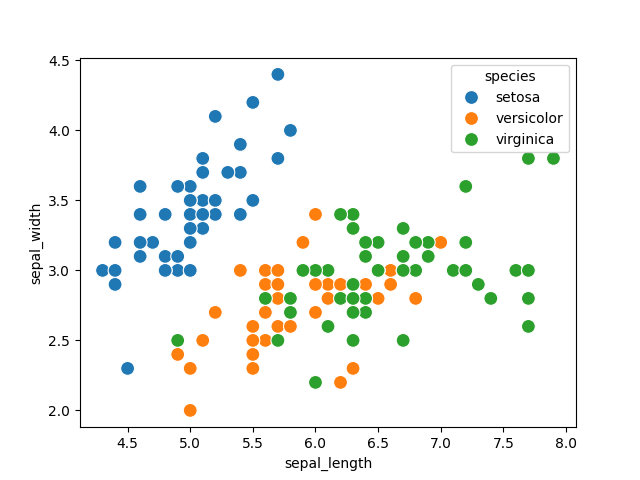

Now each species is shown in a different color and the clusters that were barely visible before are now clearly separated. Seaborn automatically adds a legend for the hue groups.

### Customizing with Matplotlib Functions

Since Seaborn is built on top of Matplotlib, all the usual `plt` functions work on Seaborn plots too:

```python
plt.figure(figsize=(12, 6))

sns.scatterplot(x=flower_df.sepal_length,
                y=flower_df.sepal_width,
                hue=flower_df.species,
                s=100)

plt.title("Sepal Dimensions by Species")
plt.xlabel("Sepal Length")
plt.ylabel("Sepal Width")
plt.show()
```

### Passing the DataFrame Directly

Instead of passing full Series (`flower_df.sepal_length`), you can pass just the column names as strings and supply the DataFrame separately using the `data` parameter. This is cleaner and less repetitive:

```python
plt.figure(figsize=(12, 6))

sns.scatterplot(x='sepal_length',
                y='sepal_width',
                hue='species',
                s=100,
                data=flower_df)

plt.title("Sepal Dimensions by Species")
plt.show()
```

**Output:**


Both approaches produce identical results — the `data` parameter is just the preferred style when working with DataFrames.

### Quick Reference Table

| Argument | Purpose | Example |
|----------|---------|---------|
| `x` | Column for x-axis | `x='sepal_length'` |
| `y` | Column for y-axis | `y='sepal_width'` |
| `hue` | Color points by category | `hue='species'` |
| `s` | Size of each point | `s=100` |
| `data` | The DataFrame to use | `data=flower_df` |

## Histograms

### What is a Histogram?

A histogram represents the **distribution of a single variable** by grouping values into ranges called **bins** and showing how many data points fall into each bin. Unlike a bar chart which compares categories, a histogram answers the question: *"where are most of my values concentrated?"*

We will use the iris dataset again:

```python
flower_df = sns.load_dataset("iris")
```

### Basic Histogram

```python
plt.title("Distribution of Sepal Width")
plt.hist(flower_df.sepal_width)
plt.show()
```

**Output:**

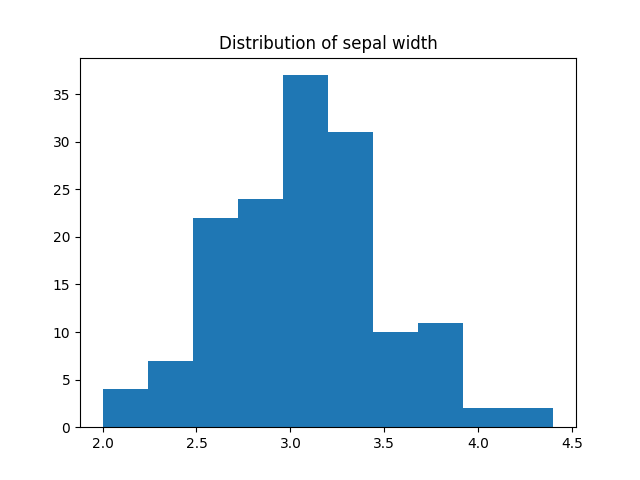

By default, Matplotlib creates **10 bins** and distributes all values across them. The x-axis shows the value ranges and the y-axis shows how many data points fall in each bin. So a bar at x=3.0 with height 37 means 37 flowers have a sepal width between 3.0 and 3.25.

### Controlling the Number of Bins

You can control how many bins are created by passing the `bins` argument. Fewer bins give a broader picture, more bins give finer detail. Adding `edgecolor='black'` draws a border around each bar so the bins are visually separated:

```python
plt.hist(flower_df.sepal_width, bins=5, edgecolor='black')
plt.title("Distribution of Sepal Width")
plt.show()
```

**Output:**

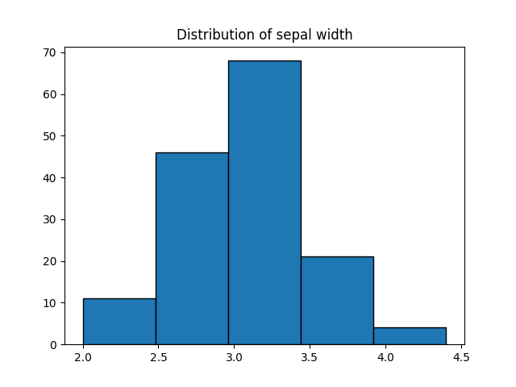

### Setting Exact Bin Boundaries with NumPy

Instead of specifying a count, you can pass exact boundary points using `np.arange()`. This gives you full control over where each bin starts and ends:

```python
import numpy as np

plt.hist(flower_df.sepal_width, bins=np.arange(2, 5, 0.25), edgecolor='black')
plt.title("Distribution of Sepal Width")
plt.show()
```

`np.arange(2, 5, 0.25)` generates points from 2 up to (but not including) 5, with a step of 0.25 — so each bin covers a range of 0.25 units.

**Output:**

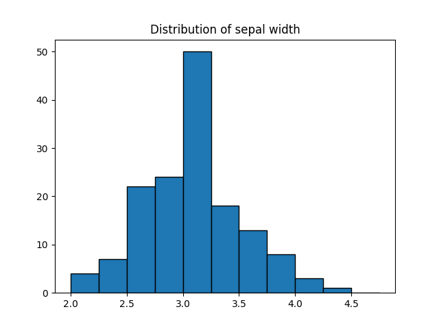

### Unequal Bin Sizes

You can also pass a manual list of boundary points to create bins of unequal size. This is useful when your data is not evenly spread and you want finer detail in a specific range:

```python
plt.hist(flower_df.sepal_width, bins=[1, 3, 4, 4.5], edgecolor='black')
plt.title("Distribution of Sepal Width")
plt.show()
```

This creates three bins of different sizes:

| Bin | Range | Width |
|-----|-------|-------|
| 1 | 1.0 → 3.0 | 2.0 |
| 2 | 3.0 → 4.0 | 1.0 |
| 3 | 4.0 → 4.5 | 0.5 |

### Stacked Histograms for Multiple Groups

You can overlay histograms for multiple groups by passing a list of Series and setting `stacked=True`. First filter the DataFrame into separate groups:

```python
setosa_df    = flower_df[flower_df.species == 'setosa']
versicolor_df = flower_df[flower_df.species == 'versicolor']
virginica_df  = flower_df[flower_df.species == 'virginica']

plt.title("Distribution of Sepal Width")
plt.hist([setosa_df.sepal_width, versicolor_df.sepal_width, virginica_df.sepal_width],
         bins=np.arange(2, 5, 0.25),
         stacked=True,
         edgecolor='black')
plt.legend(['Setosa', 'Versicolor', 'Virginica'])
plt.show()
```

**Output:**

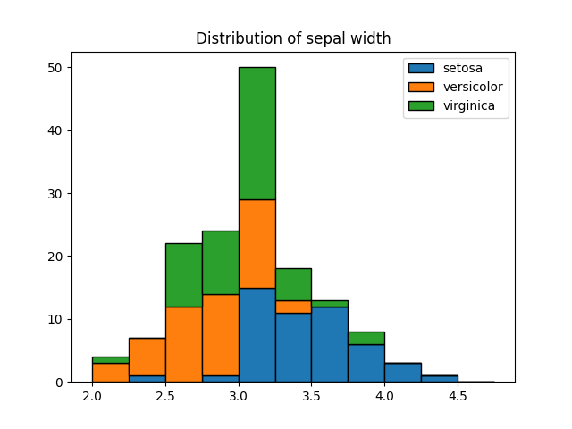

**How to read this chart:**

Each bar is divided into colored segments — one per species. The segments are stacked on top of each other, so the **total height of the bar** is the combined count of all three species for that bin. To find the count for a single species in a bin, look at the height of just its colored segment:

| Color | Species | How to read |
|-------|---------|-------------|
| 🟦 Blue | Setosa | Always at the bottom — its height is read directly from 0 |
| 🟧 Orange | Versicolor | Stacked on top of blue — its count is the height of the orange segment alone |
| 🟩 Green | Virginica | Stacked on top of orange — its count is the height of the green segment alone |

```
Total bar height = 50
├── Green (Virginica)   → starts at 30, ends at 50 → count = 20
├── Orange (Versicolor) → starts at 15, ends at 30 → count = 15
└── Blue (Setosa)       → starts at 0,  ends at 15 → count = 15
```

### Quick Reference Table

| Argument | Purpose | Example |
|----------|---------|---------|
| `bins=n` | Set number of bins | `bins=5` |
| `bins=np.arange(a, b, step)` | Set exact bin boundaries | `bins=np.arange(2, 5, 0.25)` |
| `bins=[...]` | Custom unequal bin sizes | `bins=[1, 3, 4, 4.5]` |
| `edgecolor` | Border color between bins | `edgecolor='black'` |
| `stacked=True` | Stack multiple histograms | `stacked=True` |

