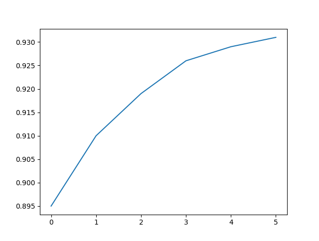

# Data Visualization with Matplotlib and Seaborn

## Table of Contents
1. [Why Visualization?](#why-visualization)
2. [Importing the Modules](#importing-the-modules)
3. [Line Charts](#line-charts)
---

## Why Visualization?

Most real-world data comes in the form of numbers — thousands or even millions of rows of values that are impossible to interpret just by looking at them. Visualization solves this by converting raw numbers into a visual format that our brains can process instantly.

For example, instead of scanning 365 rows of daily case counts to spot a trend, a single line chart shows you the rise and fall at a glance. Instead of comparing 12 monthly totals in a table, a bar chart makes the highest and lowest months immediately obvious.

Common chart types and what they are best used for:

| Chart Type | Best Used For | Example |
|------------|--------------|---------|
| **Line Chart** | Trends over time | Daily cases over a year |
| **Bar Chart** | Comparing values across categories | Total cases per month |
| **Histogram** | Distribution of a single value | How often case counts fall in a range |
| **Scatter Plot** | Relationship between two variables | Cases vs tests per day |
| **Pie Chart** | Proportions of a whole | Share of cases per region |
| **Heatmap** | Patterns across two dimensions | Cases by weekday and month |

Good visualizations do not just make data look nice — they reveal patterns, outliers, and trends that would otherwise stay hidden in a spreadsheet.

---

## Importing the Modules

Python has two main libraries for data visualization that are used together:

- **Matplotlib** — the foundation. Handles all basic plotting: line charts, bar charts, histograms, scatter plots, and full control over labels, colors, axes, and figure size.
- **Seaborn** — built on top of Matplotlib. Adds more advanced and visually polished chart types with less code, and works especially well with pandas DataFrames.

```python
import matplotlib.pyplot as plt
import seaborn as sns
```

**Why `plt` and `sns`?** These are the standard aliases used universally — every tutorial, documentation page, and Stack Overflow answer uses them. Stick to these aliases to keep your code readable and consistent.

## Line Charts

### What is a Line Chart?

A line chart is the most basic form of data visualization. It plots individual data points along an axis and connects them with a line, making it easy to see how a value changes over a sequence — most commonly over time.

### Basic Line Chart

To draw a line chart, pass a list of values to `plt.plot()` and call `plt.show()` to display it:

```python
yield_apples = [0.895, 0.91, 0.919, 0.926, 0.929, 0.931]

plt.plot(yield_apples)
plt.show()
```

`plt.plot()` draws the chart and `plt.show()` actually renders and displays it. Without `plt.show()`, nothing appears on screen.

**Output:**



The x-axis shows the index of each value (0, 1, 2...) and the y-axis shows the actual values. By default there are no labels or titles — those need to be added manually, which is covered in the next section.
